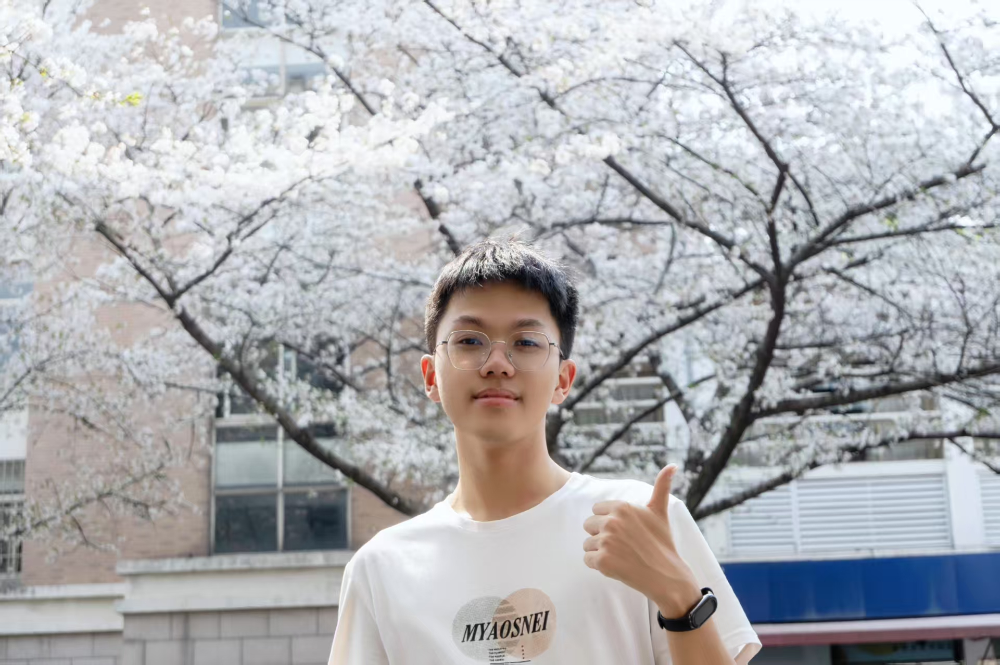
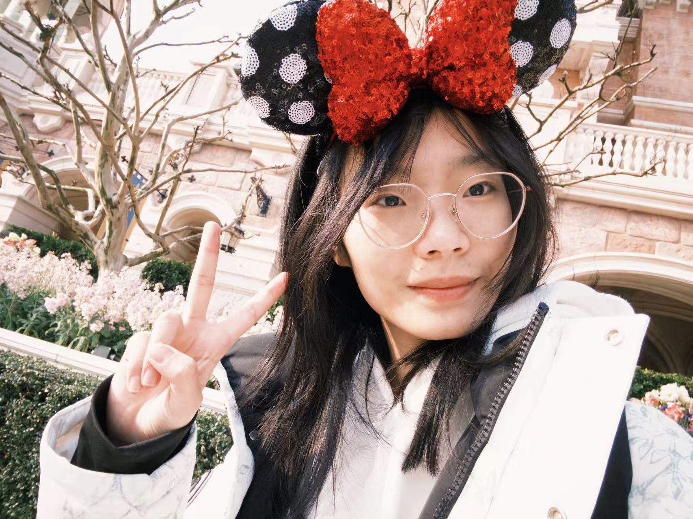
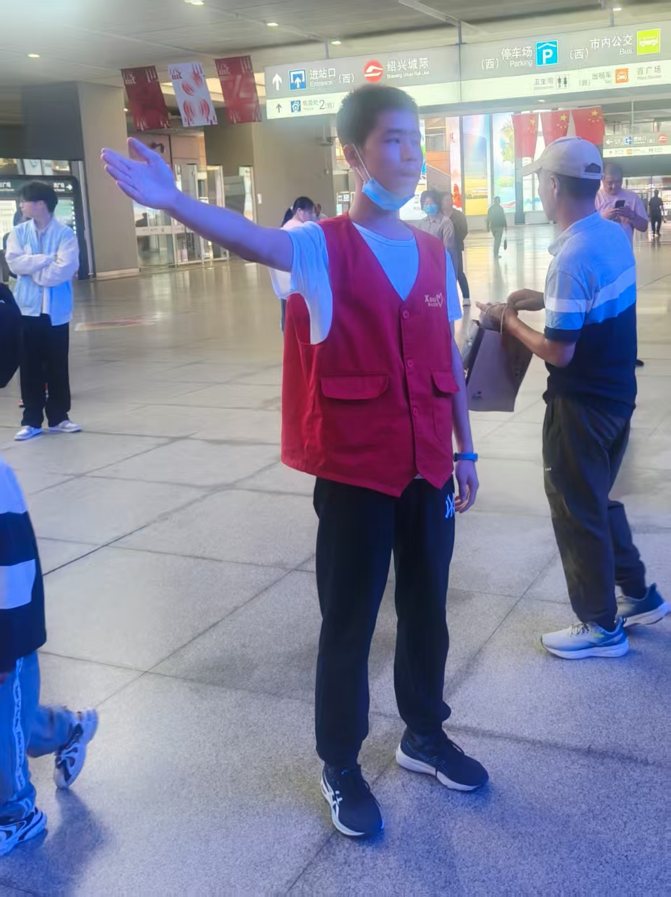

# 2502班级见面会及班团组建

<!--s-->

# Part.1 学长组成员介绍

<!--v-->
## 江征远
> 帅气幽默的组长大人

- 爱好一
- 爱好二
- 爱好三

<!--v-->
## 谭飞扬
> 酷酷的学长

- 爱好一
- 爱好二
- 爱好三

<!--v-->
## 周瑛琦
> 知心大姐姐

- 爱好一
- 爱好二
- 爱好三

<!--v-->

## 朱容阳

> 耐心的OI大神

- 爱好一
- 爱好二
- 爱好三

<!--v-->

## 魏卓廷

> ~~梦想是成为羽毛球大师~~一个羽毛球菜鸡

- 羽毛球
- 围棋
- 各种小说

<!--s-->

# Part.2 班团破冰

<!--v-->

## 自我介绍
畅所欲言~

<!--s-->

# Part.3 游戏环节

<!--v-->

## 猜歌名

<!--v-->

## 你画我猜

<!--v-->

## 击鼓传花

<!--s-->

# Part.4 班团建设

<!--v-->

## 组建班级微信群

<!--v-->

## 竞选班委
